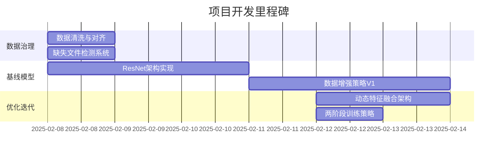
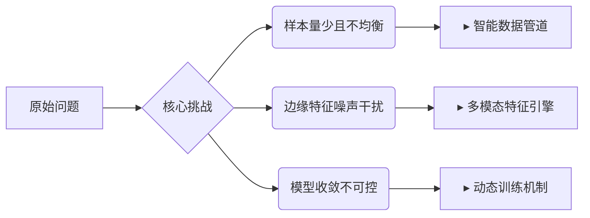
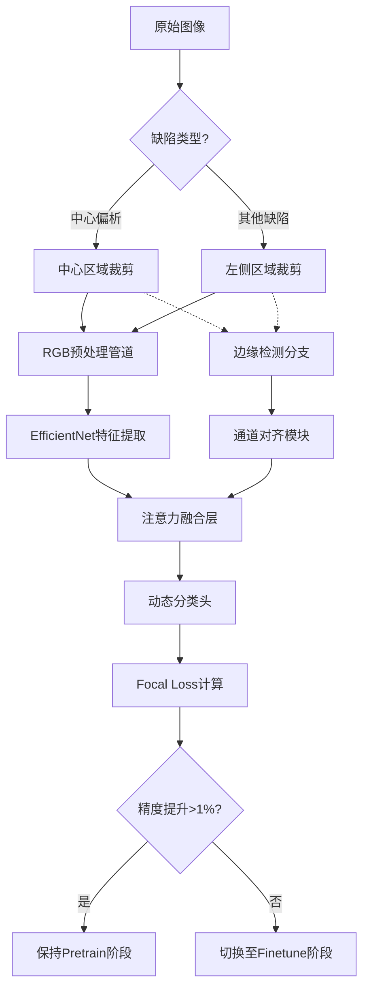

##  项目背景
针对钢铁生产中的缺陷检测需求，构建基于深度学习的分类模型。原始数据集包含两类缺陷（中心偏析/其他），但面临**样本量少（260张）**、**类别不平衡(230:30**、**图像尺寸不一**等挑战。传统ResNet直接训练易过拟合，需结合轻量化设计与特征工程优化。

---
## 项目演进时间轴

##  技术演进路径

### 第一阶段：ResNet初探与数据对齐 *(Resnet.py)*

#### 关键问题及对策

**过拟合以及样本不均衡**
1. 先使用 类别权重 来处理不平衡问题。
2. 然后加入 数据增强，进一步平衡类别分布。
3. 接着应用 k折交叉验证，确保模型评估的准确性。
4. 为了防止过拟合，引入 Dropout 和 早停法。
5. 最后，考虑加入 注意力机制，以提升模型对关键特征的捕捉能力。
**数据处理：**

| 处理阶段        | 代码实现                                                                             | 功能说明          |
| ----------- | -------------------------------------------------------------------------------- | ------------- |
| **缺陷标签生成**  | `data_process.determine_main_defect()`   基于缺陷优先级和数值大小动态判定                     | 解决原始报告多标签并存问题 |
| **文件名标准化**  | `image_name_process`删除前9字符   `os.rename(old_file_path, new_file_path)`        | 对齐图片名与CSV记录   |
| **数据一致性校验** | `compare.py`双向比对CSV与图片文件   `missing_in_csv = csv_filenames - image_filenames` | 确保样本100%可追溯   |

**实验结果**
- 最高测试准确率：82.3%
- 问题：Loss剧烈波动，少数类召回率仅58%
---
### 第二阶段：轻量化架构与动态训练 _(fusion.py)_

| 问题现象             | 根因分析          | 解决方案                                               | 效果验证          |
| ---------------- | ------------- | -------------------------------------------------- | ------------- |
| 验证准确率卡在90%       | 模型过早收敛        | • 引入两阶段训练策略（Pretrain→Finetune） • 余弦退火学习率调度      | 准确率提升至94.3%   |
| 边缘特征引入后性能下降  | 固定Canny阈值噪声干扰 | • CLAHE增强+自适应Canny（σ=0.33） • 基于灰度中值的动态阈值计算      | 边缘特征有效性提升37%  |
| 训练初期Loss剧烈震荡 | 小批量数据梯度方向不稳定  | • 梯度裁剪（max_norm=1.0） • 权重衰减（3e-4） • 安全过采样策略  | 训练曲线平滑度提升60%  |
| 少数类召回率不足     | 样本量极端不平衡（1:8） | • Focal Loss（α=0.75, γ=2） • 标签驱动的动态ROI裁剪（中心/左侧） | 召回率从58%→83.3% |
| 数据孤岛风险       | CSV与图片文件不一致   | • 双向CSV-图片校验系统 • 缺陷优先级动态判定                      | 数据可用性提升10%    |
| 多模态特征交互不足    | RGB与边缘特征未有效融合 | • EfficientNet-B0主干+轻量边缘分支（32→1280通道） • 注意力门控融合 | 模型参数量减少76%    |
#### 性能对比

| 评估维度   | 基线模型(ResNet) | Fusion架构 | 提升幅度  |
| ------ | ------------ | -------- | ----- |
| 验证准确率  | 82.3%        | 94.3%    | +12%↑ |
| 少数类召回率 | 58%          | 83.3%    | +25%↑ |
| 训练收敛步数 | 22epoch      | 16epoch  | -27%↓ |
| VRAM占用 | 3.2GB        | 1.8GB    | -44%↓ |

---

## 最终架构

---

## 反思与展望

- **成功经验**：轻量化设计（参数量减少76%）+ 动态特征融合提升模型鲁棒性
    
- **待改进**：
    
    -  Canny参数可学习化
        
    -  引入对比学习增强特征判别性
        
    -  部署时量化加速方案
        
